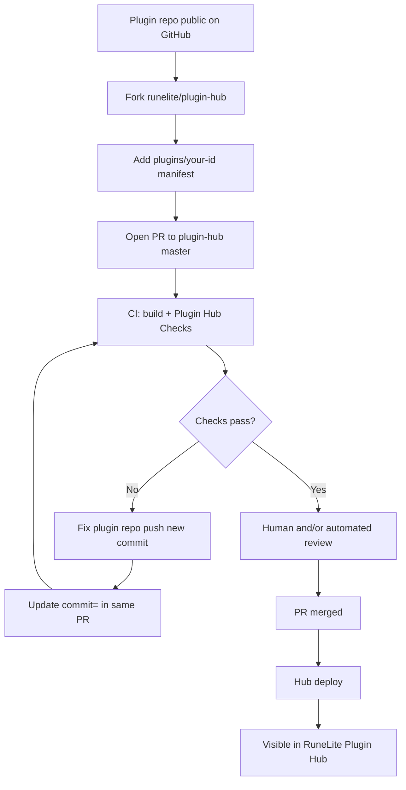

# RuneLite third-party plugins and the Plugin Hub

This guide explains how RuneLite’s **Plugin Hub** works: what it is, how plugins get listed, what reviewers look for, and how that relates to FlipX. It is meant for reading in a Markdown preview (VS Code, Cursor, GitHub).

For FlipX’s submission checklist and manifest steps, see **[PLUGIN_HUB.md](../PLUGIN_HUB.md)** in the repo root.

---

## Two ways plugins exist in RuneLite

| Model | Who builds it | How users get it |
| ----- | ------------- | ---------------- |
| **Core client** | RuneLite team | Shipped inside the official client |
| **Third-party (Plugin Hub)** | Anyone with a public GitHub repo | Installed from **Configuration → Plugin Hub** in the client |

FlipX is a **third-party** plugin. RuneLite does not host your source code in their main repo; they maintain a **catalog** that points at your repo and a specific commit.

---

## What the Plugin Hub actually is

The [runelite/plugin-hub](https://github.com/runelite/plugin-hub) repository is not a pile of plugin JARs. Each listed plugin is a small text file under `plugins/`, for example `plugins/flipx`:

```text
repository=https://github.com/JoshiOS-VRY/osrs-flip-plugin.git
commit=abc123def4567890abc123def4567890abc123de
```

| Field | Meaning |
| ----- | ------- |
| `repository` | Public GitHub URL (HTTPS) of the plugin project |
| `commit` | Full **40-character** Git commit SHA users receive |

Important details:

- The hub pins a **commit hash**, not a Git tag or branch name. Tags are optional but useful for humans; the manifest always uses SHA.
- When the hub is deployed, RuneLite’s infrastructure **builds and verifies** that commit using your plugin’s Gradle setup (especially with `build=standard` in `runelite-plugin.properties`).
- After merge, users search the in-client Plugin Hub, click Install, and RuneLite **downloads and updates** the plugin automatically—no manual JAR unless they sideload.

Your plugin code stays in **your** repository. The hub only records “which revision is approved.”

---

## End-to-end flow (first-time listing)



### Step 1 — Prepare the plugin repository

Typical expectations before opening a hub PR:

| Area | Requirement |
| ---- | ----------- |
| Visibility | **Public** GitHub only |
| Metadata | `runelite-plugin.properties`: display name, author, description, tags, main plugin class, `version`, preferably `build=standard` |
| License | Open license (FlipX uses BSD-2) |
| Icon | `icon.png` at repo root (size limits apply; FlipX uses 48×48) |
| Dependencies | Avoid extra runtime dependencies beyond what RuneLite provides. New third-party deps need hash verification in plugin-hub and **manual maintainer sign-off**, which slows review significantly |
| Third-party servers | Privacy policy URL, clear UX disclosure; config **warnings** when data goes to non-RuneLite servers |

FlipX additionally: production API at `https://www.flipx.gg`, privacy at [flipx.gg/privacy](https://www.flipx.gg/privacy), opt-in network features, no GE automation.

### Step 2 — Fork plugin-hub and add a manifest

1. Fork [https://github.com/runelite/plugin-hub](https://github.com/runelite/plugin-hub).
2. Create a branch (e.g. `flipx`).
3. Add `plugins/<id>` where `<id>` is lowercase, no spaces (e.g. `flipx`).
4. Set `repository=` and `commit=` to the exact revision you want live.

### Step 3 — Open one pull request

- Target: **`runelite/plugin-hub`** branch **`master`**.
- PR description should state plainly:
  - What the plugin does
  - Link to privacy policy
  - That network features are **opt-in**
  - That there is **no automation** (no clicking GE, no price injection)
  - Any non-obvious behavior (e.g. optional backfill from RuneLite’s saved GE history when upload is enabled)

**Keep a single PR.** If review asks for fixes, push to your plugin repo, then update only `commit=` in the same hub PR. Opening many PRs spams reviewers.

### Step 4 — Automated checks on the hub PR

| Check | What it catches |
| ----- | ----------------- |
| **build** (`build.yml`) | Bad commit SHA, compile errors, Gradle failures |
| **RuneLite Plugin Hub Checks** | Policy/security scanning; bot may comment “Changes are needed” |

Plugins using the standard Gradle template and passing checks may be eligible for **automated review** on some updates (see below).

### Step 5 — Review and merge

Timeline is **not fixed**—often days to weeks for a first submission, especially for larger plugins.

After merge, wait for the **hub deploy**; then the plugin appears under **Configuration → Plugin Hub** (search by name or tags).

---

## What review is (and is not) about

Official reference: [Plugin Hub Review](https://github.com/runelite/runelite/wiki/Plugin-Hub-Review) on the RuneLite wiki.

### In scope

| Focus | Intent |
| ----- | ------ |
| **Security** | No credential theft, malware, or risky patterns; limits on reflection/native code; dependency controls; automated scanning |
| **Game rule compliance** | Jagex [third-party client guidelines](https://secure.runescape.com/m=news/third-party-client-guidelines?oldschool=1) and RuneLite’s [rejected features](https://github.com/runelite/runelite/wiki/Rejected-or-Rolled-Back-Features)—interpreted best-effort; rules can be subjective |

### Explicit non-goals

Reviewers **do not** guarantee:

- The plugin works well or is useful
- Good performance or no lag
- Compatibility with other plugins
- Accuracy of displayed information

If a plugin destabilizes the client or ecosystem, RuneLite may disable it regardless.

### Who reviews

- **Initial submissions** and complex plugins: mostly **human** reviewers (RuneLite volunteers/maintainers).
- Since ~April 2026: an **automated review bot** can approve **many simple plugin updates** after CI passes—driven by volume of submissions and AI-generated code.
- **Updates** after listing: new hub PR that changes only `commit=`; same CI path; simpler changes may be bot-approved.

FlipX is a **large, networked, paid-tier** plugin—expect **human review** on first listing even if the code is clean.

---

## Jagex / RuneLite compliance patterns (FlipX-shaped)

These patterns align with what hub review typically wants for GE-related tools:

| Pattern | FlipX approach |
| ------- | -------------- |
| No automation | Observes GE state; overlays are **display-only**; no menu injection, clicks, or filling GE fields |
| Opt-in network | Upload, market, copilot, chart, watchlist hints default **off**; RuneLite **IP warnings** on enabling |
| Pairing gate | User must enable upload **or** market in config (with warnings) before **Connect** sends data |
| Third-party API | Fixed production host; privacy policy; open source |
| Standard build | `build=standard`, `compileOnly` RuneLite client, no extra runtime deps in Gradle |

---

## Before Hub approval: sideloading

For beta testers while the hub PR is open:

```bash
cd osrs-flip-plugin
export JAVA_HOME="/opt/homebrew/opt/openjdk@17/libexec/openjdk.jdk/Contents/Home"  # macOS Homebrew example
./gradlew test shadowJar
# Output: build/libs/flipx-plugin-1.0.0-all.jar
```

Users enable **Developer mode** in RuneLite, then either:

- `./gradlew installSideloaded`, or  
- **Developer → Load local plugin** and select the JAR.

See [README.md](../README.md) and `run-dev.sh` for loading from source during development.

---

## After launch: shipping updates

Each release:

1. Merge changes to the plugin repo `main` / `master`.
2. Ensure CI is green (`./gradlew test shadowJar`).
3. Copy the new **full commit SHA**.
4. Open a PR to `runelite/plugin-hub` updating **only** `commit=` in `plugins/flipx`.

Hub docs: [Updating a plugin](https://github.com/runelite/plugin-hub#updating-a-plugin).

---

## Dependencies and supply chain

Plugin Hub requires cryptographic verification for dependencies that are **not** transitive dependencies of `runelite-client`. Adding new deps means editing `package/verification-template/build.gradle` in plugin-hub and maintainer manual verification—often **weeks** of extra delay.

**Recommendation:** stay on RuneLite’s client APIs and bundled libraries (e.g. OkHttp via the client) unless absolutely necessary.

---

## Getting help

| Resource | Use |
| -------- | --- |
| [Plugin Hub README](https://github.com/runelite/plugin-hub/blob/master/README.md) | Submission mechanics |
| [Example plugin](https://github.com/runelite/example-plugin) | Template project |
| [RuneLite Discord](https://discord.gg/runelite) | `#plugin-hub` channel |
| [PLUGIN_HUB.md](../PLUGIN_HUB.md) | FlipX-specific checklist and PR text |

---

## FlipX readiness snapshot

Use this as a high-level gate before pinning `commit=` in a hub PR—not a substitute for [PLUGIN_HUB.md](../PLUGIN_HUB.md).

| Item | Status (maintain locally) |
| ---- | ------------------------- |
| Public repo | Done |
| `build=standard`, metadata, icons, LICENSE | Done |
| Privacy policy live | Verify at submit time |
| Production API + pairing smoke test | Verify at submit time |
| CI green on pinned commit | Run `./gradlew test shadowJar` |
| Hub PR opened | When ready |

---

## Glossary

| Term | Definition |
| ---- | ---------- |
| **Plugin Hub** | RuneLite’s curated catalog of third-party plugins, built into the client |
| **Manifest** | `plugins/<id>` file with `repository=` and `commit=` |
| **Sideload** | Load a local JAR via Developer mode, bypassing the hub |
| **Standard build** | Plugin uses RuneLite’s conventional Gradle integration (`build=standard`) |
| **Hub deploy** | Process that publishes merged manifest changes so clients see new plugins/versions |
